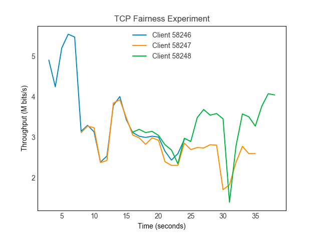

# TCP Fairness

Project to confirm TCP fairness for avoiding buffers congestion over the network.

### Instructions

Remove all `.class`

```shell
make clean
```

Generate all `.class` files

```shell
make build
```

Generate the graph
```shell
make graph
```

### Running the experiment

Run the server on `TCP_PORT`

```java
java Server [TCP_PORT]
```

Run the clients and connect to server

```java
java Client [SERVER_IP] [TCP_PORT]
```

### Graph example



### Dependencies

- Java 8
- Python 2.7
- pip install matplotlib

### License
MIT License. [Click here for more information.](LICENSE)